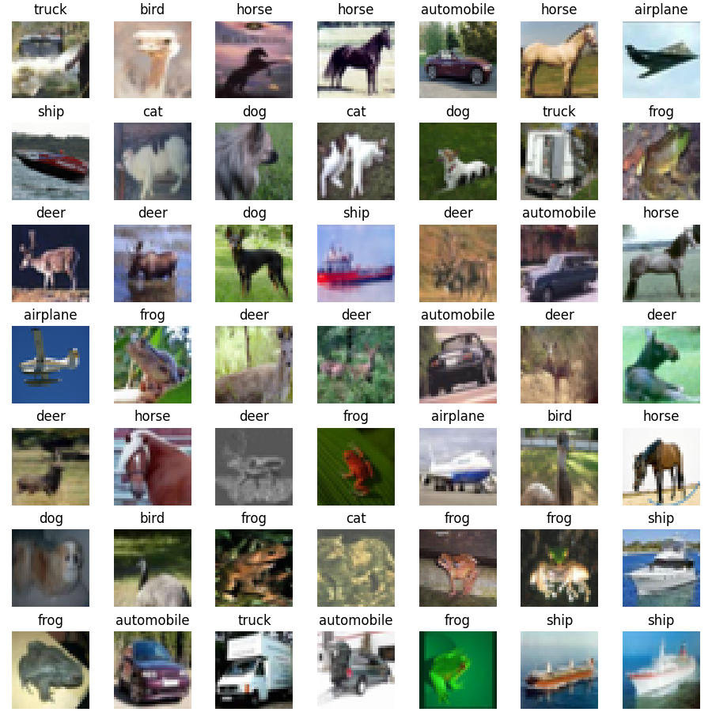

# Machine Learning Applications

## Description

Repository contains projects created on the lecture *Machine Learning Applications* at my University. The goal is to learn and experiment with different types of neural networks written in *PyTorch*. All visualizations are created in *MatPlotLib*.

## Images

# PINNs

# ECG Classification

    
    

    
    

# Regularization

    
    

    
    

# Advanced CNN

    
    

    
    

    
    

# Perceptrons

    
    

    
    

